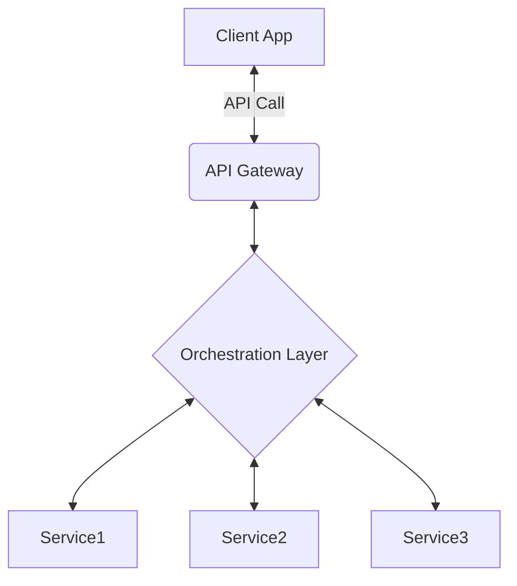

## The Problem: Too Many API Calls!
In a microservices architecture, each service should live cleanly within a single domain, and we should avoid coupling domains within a microservice as much as possible. However, this poses a problem for client apps that want to collect data from multiple domains to display to the user within a single app. As the number of microservices grows, so too does the number of API calls the client apps need to make to gather data from disparate data sources and the amount of business logic necessary to combine this data into something that is presented to the user.

The primary problems that arise when pushing the responsibility of aggregating data from multiple microservices onto mobile clients are that mobile devices have inconsistent network connections, and additional business logic in client apps can result in heavy maintenance costs. To solve these issues, an orchestration layer (also called Integration Layer) may be needed.

## What is an Orchestration Layer?
An orchestration layer is an abstraction layer that collects data from multiple back end services and combines the data into a response that makes sense for the consumer. For the purpose of this article, the consumer will be assumed to be mobile apps, but it could be anything, including microservices, web servers, websites, or JVM apps.

API Orchestration is a common pattern in microservice based architectures because it provides a convenient place outside of microservices to aggregate data across domains and solves the issues that mobile clients can face. An orchestration layer that performs data aggregation for mobile clients can help alleviate the issue of inconsistent network connections by reducing the number of API calls the mobile clients need to make. In general, mobile-to-server communication is slow and unreliable, making server-to-server communication fast and reliable by comparison. Therefore, by having an orchestration layer make multiple API calls for the mobile apps and returning the data in a single response, we reduce the number of API calls that clients have to make and reduce the risk of one of the individual API calls being slow or failing.



An orchestration layer can also help avoid adding data aggregation logic to mobile clients, reducing duplicated logic, and maintenance costs. In native mobile apps, extensive amounts of business logic can lead to a large amount of code duplication between platforms (Android, iOS), and differences in behavior. This can be mitigated somewhat with a cross-platform implementation such as React Native or Kotlin Multiplatform, but often it is more cost effective when dealing with legacy apps to instead push this logic into an orchestration layer.

In conclusion, an orchestration layer can help bridge the gap between microservices and mobile apps, allowing for a more efficient and scalable architecture. It solves the issues of inconsistent network connections and heavy maintenance costs, while also providing a convenient place to aggregate data across domains.

## Possible Implementation Approaches

There are many possible approaches to building an orchestration layer. It can be anything from a single lambda that performs some business logic to a full EC2 instance that has multiple responsibilities. I recommend starting small with an implementation that can be quickly scaled up or built upon to perform multiple functions.

Detailed below is one example of a quickly scalable and re-usable implementation using an AWS state machine made up of AWS Lambdas.

### Step Function based State Machine
AWS Step Functions are lambdas that perform one action and pass along data. These lambdas can be combined into a state machine (using a single JSON configuration file) that performs multiple tasks with the output of each state being dependent on the previous state. Below is an example for adding pet data to a pet store database. It has a comment at the top that describes the purpose of the state machine, a starting state, and a list of states that describe which resource to call, how to handle the data, and which state to go to next
```json
{
  "Comment": "Add Pet State Machine - calls rest endpoints",
  "StartAt": "Add Pet to Store",
  "States": {
    "Add Pet to Store": {
      "Type": "Task",
      "Resource": "arn:aws:states:::apigateway:invoke",
      "Parameters": {
        "ApiEndpoint": "<POST_PETS_API_ENDPOINT>",
        "Method": "POST",
        "Stage": "default",
        "Path": "pets",
        "RequestBody.$": "$.NewPet",
        "AuthType": "IAM_ROLE"
      },
      "ResultSelector": {
        "ResponseBody.$": "$.ResponseBody"
      },
      "Next": "Pet was Added Successfully?"
    },
    "Pet was Added Successfully?": {
      "Type": "Choice",
      "Choices": [
        {
          "Variable": "$.ResponseBody.errors",
          "IsPresent": true,
          "Next": "Failure"
        }
      ],
      "Default": "Retrieve Pet Store Data"
    },
    "Failure": {
      "Type": "Fail"
    },
    "Retrieve Pet Store Data": {
      "Type": "Task",
      "Resource": "arn:aws:states:::apigateway:invoke",
      "Parameters": {
        "ApiEndpoint": "<GET_PETS_API_ENDPOINT>",
        "Method": "GET",
        "Stage": "default",
        "Path": "pets",
        "AuthType": "IAM_ROLE"
      },
      "ResultSelector": {
        "Pets.$": "$.ResponseBody"
      },
      "ResultPath": "$.ExistingPets",
      "End": true
    }
  }
}
```

Pros:
- The JSON config is quick to put together and easy to understand
- Each lambda performs one atomic action, so they could be re-used for other state machines
- Can be configured directly in the api gateway, so no additional code for proxying/routing needed

Cons: 
- Requires multiple lambdas that may seem unrelated without the context of the JSON config
- States don't run concurrently, so larger state machines will be slower than small ones - this gives an adverse incentive to create less steps and shove more business logic in to each step

### GraphQL
Another option that can start small and quickly scale is using GraphQL running in a single lambda. This implementation is slightly heavier than the state machine option because it will require clients to implement GraphQL style api calls, but it can be scaled quickly and allows for easily recombining the retrieved data via GraphQL queries. Additionally, this approach can wrap existing rest APIs to be quickly slotted into an existing microservice architecture.

Here's an example lambda implementation for wrapping REST API calls for a service that fetches data about Person and People data models. (source: GraphQL wrapping REST APIs guide)

```javascript
import {
  GraphQLList,
  GraphQLObjectType,
  GraphQLSchema,
  GraphQLString,
} from 'graphql';

const BASE_URL = 'https://myapp.com/';

function fetchResponseByURL(relativeURL) {
  return fetch(`${BASE_URL}${relativeURL}`).then(res => res.json());
}

function fetchPeople() {
  return fetchResponseByURL('/people/').then(json => json.people);
}

function fetchPersonByURL(relativeURL) {
  return fetchResponseByURL(relativeURL).then(json => json.person);
}

const PersonType = new GraphQLObjectType({
  /* ... */
  fields: () => ({
    /* ... */
    friends: {
      type: new GraphQLList(PersonType),
      resolve: person => person.friends.map(fetchPersonByURL),
    },
  }),
});

const QueryType = new GraphQLObjectType({
  /* ... */
  fields: () => ({
    allPeople: {
      type: new GraphQLList(PersonType),
      resolve: fetchPeople,
    },
    person: {
      type: PersonType,
      args: {
        id: { type: GraphQLString },
      },
      resolve: (root, args) => fetchPersonByURL(`/people/${args.id}/`),
    },
  }),
});

export default new GraphQLSchema({
  query: QueryType,
});
```

Pros:
- GraphQL can be spun up in a Lambda for cost effectiveness or it can live in a dedicated server for ease of use and scaling
- GraphQL allows for quickly recombing data via GraphQL queries
- Can be implemented using Java/Kotlin and Spring for a long lived multi-threaded service

Cons: 
- Requires more time to set up both on the back end and front end than the equivalent lambda based approaches
- API Calls must be done using GraphQL instead of the often more familiar REST format

## Resources
- [Serverless step function workflow](https://aws.amazon.com/getting-started/hands-on/create-a-serverless-workflow-step-functions-lambda/)
- [sample step function projects](https://docs.aws.amazon.com/step-functions/latest/dg/create-sample-projects.html) 
- [GraphQL](https://graphql.org/faq/#what-is-a-graphql-client-and-why-would-i-use-one)
- [Wrapping REST Apis with GraphQL](https://graphql.org/blog/rest-api-graphql-wrapper/)
